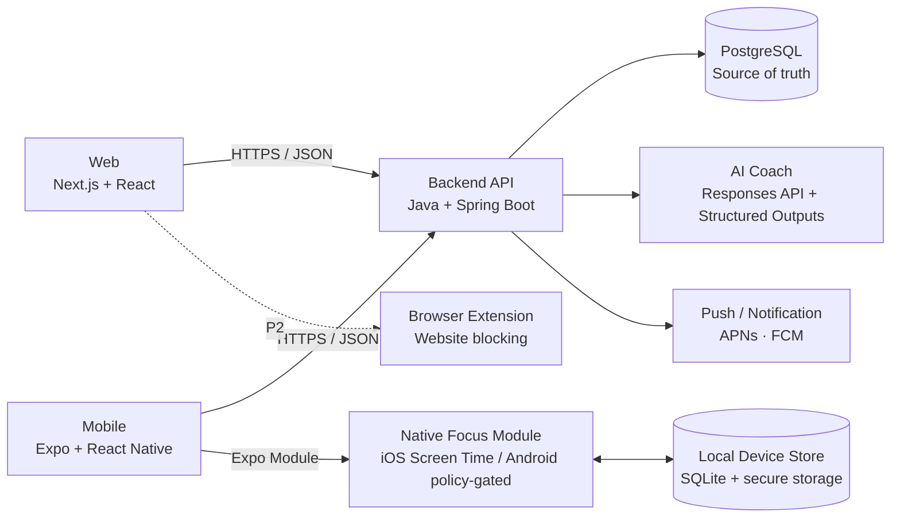
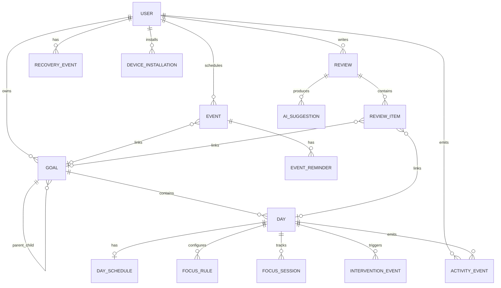

# DayFlow Requirements & Technical Design

> **문서 역할:** 이 파일을 DayFlow 구현의 요구사항/기술 설계 **Source of Truth**로 사용한다.  
> UI/인터랙션의 시각적 기준은 `docs/prototype.html`, 제품 철학과 문제 정의의 보조 문서는 `docs/product-spec.md`를 참고한다.  
> 충돌이 있을 경우 이 문서의 기술 선택과 요구사항 ID/Acceptance Criteria를 우선한다.

**Core Loop:** Goal → Day → Focus → Review → Recovery → Next Plan

| **문서 버전**       | v1.0                                                       |
|---------------------|------------------------------------------------------------|
| **작성 기준일**     | 2026-09-15                                                 |
| **기준 프로토타입** | DayFlow Prototype v0.6                                     |
| **문서 목적**       | 웹·앱 크로스플랫폼 구현을 위한 개발 요구사항/아키텍처 확정 |

| **핵심 제품 정의** 계획을 완벽하게 지키게 만드는 앱이 아니라, 계획이 무너져도 목표를 포기하지 않고 다시 돌아오게 만드는 실행·회복 중심의 AI Goal Coach. |
|---------------------------------------------------------------------------------------------------------------------------------------------------------|

# 0. 기술 의사결정 요약
이 문서는 제공된 HTML 프로토타입의 UX와 데이터 구조를 유지하면서, 실제 멀티디바이스 서비스로 전환하기 위한 기준안을 정의한다. 핵심 원칙은 “하나의 코드베이스에 모든 플랫폼을 억지로 맞추기”가 아니라, 비즈니스 로직·API 계약·디자인 토큰은 공유하고 OS 종속 기능은 네이티브로 분리하는 것이다.

| **영역**             | **선택**                                                  | **결정 이유**                                                     |
|----------------------|-----------------------------------------------------------|-------------------------------------------------------------------|
| 프론트엔드 공통 언어 | TypeScript                                                | 웹/모바일의 도메인 타입·API 계약·검증 로직 공유                   |
| Web                  | Next.js 16.3 + React 19.2                                 | 데스크톱 Calendar/Review UX, SSR/배포 안정성                      |
| Mobile               | Expo SDK 57 + React Native 0.86 + Expo Router             | iOS/Android 공통 UI·로직 + Custom Native Module 확장              |
| iOS Native           | Swift + FamilyControls / ManagedSettings / DeviceActivity | 앱 잠금·허용 앱 지정·예약 Focus Lock 구현                         |
| Android Native       | Kotlin + Usage/Accessibility 계층(정책 검토 필수)         | 동등한 강제 차단은 OS/Play 정책 차이로 feature flag 처리          |
| Backend              | Java 21 LTS + Spring Boot 4.1                             | 사용자의 Java 백엔드 포트폴리오 가치 + 안정적인 API/보안/스케줄링 |
| DB                   | PostgreSQL 18                                             | Goal 계층·일정·리뷰·이벤트 분석에 적합한 관계형 모델              |
| Mobile local DB      | SQLite (expo-sqlite)                                      | 오프라인 실행, Focus 규칙/세션을 네트워크와 독립적으로 유지       |
| Server state         | TanStack Query v5                                         | 웹/React Native 모두 사용 가능, 캐시/동기화/낙관적 업데이트       |
| Client UI state      | Zustand                                                   | 모달·선택·임시 편집·캘린더 UI 상태만 관리                         |
| AI                   | OpenAI Responses API + JSON Schema Structured Outputs     | 근거/제안/적용 액션을 구조화해 안전하게 저장·검증                 |
| Monorepo             | pnpm + Turborepo                                          | web/mobile/shared TS 패키지를 한 저장소에서 관리                  |

| **중요** Web과 Mobile의 화면을 100% 동일 컴포넌트로 공유하지 않는다. Calendar·드래그 UX는 플랫폼별 최적화가 필요하다. 대신 domain, schemas, API client, analytics event, design tokens를 공유한다. |
|----------------------------------------------------------------------------------------------------------------------------------------------------------------------------------------------------|

# 1. 프로토타입 기준선과 Production Gap
## 1.1 현재 v0.6에서 이미 검증된 UX
- 좌측/하단 네비게이션: Today / Goals / Calendar / Days / Review (v0.6 기준). Production desktop navigation 기준은 Event 추가에 따라 Today / Goals / Calendar / Events / Days / Review로 확장한다(EVT-002).

- Goal 계층: YEAR → QUARTER → MONTH → WEEK, self hierarchy 및 하위 Goal 생성.

- 주간 Goal 아래 Day 생성, 날짜 미정 상태 지원, 주간 뷰/리스트 뷰 제공.

- Day 상세 모달에서 완료 여부, 실행 날짜, 시간 배치/해제를 수정.

- Calendar에서 미배치 Day 드래그, 시간 블록 이동, 종료 시간 리사이즈.

- Today에서 현재 Goal Path와 오늘의 Day를 연결해 노출.

- Review에서 일/주/월/분기/연 회고, KPT 작성, 만족도, Try→다음 계획 전환.

- 반응형 UI와 모바일 하단 네비게이션 기본 형태.

## 1.2 프로토타입에서 바로 Production으로 가져가면 안 되는 부분
| **항목**  | **현재**                               | **Production 요구**                                 | **우선순위** |
|-----------|----------------------------------------|-----------------------------------------------------|--------------|
| 저장소    | localStorage 단일 저장                 | 계정/서버 DB + 로컬 캐시 + 동기화 필요              | P0           |
| 시간 기준 | 2026-09-14 주간 및 Today 날짜 하드코딩 | 사용자 timezone·현재일·주 시작 규칙으로 일반화      | P0           |
| Calendar  | 09~22시, 단일 주만 렌더링              | 24시간/가변 시간대/주 이동/충돌/접근성 처리         | P0           |
| 진행률    | 재귀 평균, 동일 가중치                 | 가중치/수동 진행률 정책 또는 Day 기반 명확화        | P1           |
| 인증      | 없음                                   | Apple/Google/이메일 또는 passkey + 세션/토큰 관리   | P0           |
| 오프라인  | 없음                                   | Mobile SQLite + outbox sync                         | P0           |
| Focus     | UI 없음                                | iOS Screen Time 네이티브 모듈 + 알림/개입 상태 머신 | P0           |
| AI        | 없음                                   | AI input snapshot, structured output, 승인 후 적용  | P1           |
| 분석      | 완료율 중심                            | actual focus/recovery/intervention 이벤트 기반 분석 | P1           |
| 알림      | 없음                                   | 로컬 알림 우선, push는 보조                         | P0           |
| 동시 편집 | 없음                                   | version/updated_at 기반 충돌 정책                   | P1           |

## 1.3 제품 Core Loop
| **Core Loop** Goal → Plan(Day/Calendar) → Focus → Actual → Review(KPT) → Recovery/Adjust → Next Plan |
|------------------------------------------------------------------------------------------------------|

“Focus Lock”은 제품의 목적이 아니라 실행을 돕는 장치이고, “Goal + Review + Recovery”가 제품의 본체다. AI는 사용자를 대신해 자동으로 계획을 바꾸는 에이전트가 아니라, 실제 행동을 근거로 다음 선택을 제안하는 코치다.

# 2. 범위와 릴리스 기준
## 2.1 MVP (P0) — 사용자가 실제로 매일 쓸 수 있는 최소 서비스
- 회원가입/로그인, timezone 및 코치 강도 설정.

- Goal 계층 YEAR/QUARTER/MONTH/WEEK CRUD 및 Goal Path.

- Day CRUD, 날짜 미정/날짜 지정/시간 지정, 완료/미룸/삭제/재배치.

- 주간 Calendar + 리스트, Web drag/resize, Mobile gesture 기반 수정.

- Event(일정) CRUD, Events 화면(유형 필터), Calendar에서 Day와 Event 함께 표시, 최소 반복, Goal 연결, Event reminder 설정. reminder의 native local notification 실행은 Mobile 단계에서 구현한다.

- Today: 오늘 핵심 Day, Goal Path, 시작 버튼, 남은 Day.

- 일/주/월/분기/연 Review와 KPT, Try를 다음 Day/Goal로 변환.

- iOS Focus Lock: 차단 앱 선택 또는 허용 앱 중심 규칙, 예약/즉시 시작, 자동 해제.

- 시작 안 함 개입: 예정 시각 → +10분 → +20분 → 재계획/축소/회복 선택.

- Recovery Mode: 밀린 Day 일괄 분류(유지/축소/이동/삭제) 후 주간 계획 복구.

- 로컬 알림, 모바일 오프라인 동작, 서버 동기화.

- 행동 이벤트 로그(Focus, 완료, 미룸, 개입 반응, Recovery) 수집.

## 2.2 Beta (P1) — AI Coach
- AI Review Coach: KPT 초안, 패턴 관찰, 다음 주 계획 제안, 근거 데이터 표시.

- AI Recovery Planner: 남은 주간 시간과 우선순위를 보고 재배치 후보 생성.

- 일정 기반 시간 분배: Event가 점유한 시간을 제외한 가용 시간을 계산하고, Core Day → 나머지 Day 순서의 배치 후보를 제안(자동 배치 금지, 사용자 승인 후 적용).

- AI Goal Breakdown: 연간 Goal → 분기/월/주 목표 후보 추천.

- Plan vs Actual 회고 레이어: 실제 Focus 시작/종료와 계획 차이 시각화.

- 개입 개인화: “폰 때문에 미룸/피곤함/밖에 있음/그냥 하기 싫음” 반응별 추천.

- 코치 강도: 부드럽게 / 단호하게 / 강하게.

## 2.3 Later (P2)
- Chrome/Edge Browser Extension을 통한 웹사이트 Focus Lock.

- Day 반복/루틴 템플릿, Morning Lock 프리셋. (Event 최소 반복은 P0, EVT-003)

- 캘린더 외부 연동(Google/Apple Calendar) — 양방향 편집은 별도 검토. Event 도메인 기준 확장 방향은 §5.3.

- 팀/친구 accountability, 공유 Goal, 코치 프리셋 마켓 등은 초기 범위에서 제외.

- Android hard blocking은 Play 정책 승인 가능성을 검증한 뒤 정식화.

# 3. 기능 요구사항
우선순위는 P0=MVP 필수, P1=Beta 핵심, P2=후속 확장이다. Acceptance는 QA에서 통과/실패를 판정할 수 있는 수준으로 작성한다.

| **ID**    | **Pri** | **도메인** | **요구사항**                                                           | **Acceptance**                                                                           |
|-----------|---------|------------|------------------------------------------------------------------------|------------------------------------------------------------------------------------------|
| AUTH-001  | P0      | 인증       | 사용자는 Apple/Google/이메일 중 지원 방식으로 로그인할 수 있다.        | 재로그인 시 데이터가 복구되고 다른 계정 데이터가 섞이지 않는다.                          |
| SET-001   | P0      | 개인설정   | timezone, 주 시작 요일, 코치 강도, 기본 알림을 저장한다.               | 기기 변경 후 서버에서 복구된다.                                                          |
| GOAL-001  | P0      | Goal       | YEAR→QUARTER→MONTH→WEEK 계층을 생성/수정/삭제한다. 직접 parent는 바로 위 단계만 허용하고 단계를 건너뛰지 않는다(YEAR만 parent 없음, Day의 직접 parent는 WEEK). | parent 기간 밖의 하위 Goal 생성 시 validation 오류 또는 사용자 확인을 요구한다. 계층 규칙은 UI와 무관하게 서버 validation이 최종 보장한다. |
| GOAL-002  | P0      | Goal       | Goal에 title, why, 기간(calendar period), 우선순위/가중치를 저장한다.   | Today/Review에서 상위 path와 why를 조회할 수 있다. period label(`2026`, `3분기`, `9월 3주`)과 사용자가 입력한 title은 섞지 않는다. |
| GOAL-003  | P1      | Goal       | 진행률은 Day 완료 기반 자동 계산 + 선택적 수동 보정 정책을 지원한다.   | 자동/수동 방식이 UI에서 구분된다.                                                        |
| GOAL-004  | P0      | Goal       | Goal 기간은 자유 날짜 범위가 아니라 type별 calendar period를 선택해 정한다. startDate/endDate는 선택한 period에서 파생된 canonical range다(§4.5). | YEAR=1/1~12/31, QUARTER=분기 경계, MONTH=해당 월 1일~말일(윤년 포함), WEEK=parent MONTH 안의 월요일 시작 주를 월 경계에서 자른 구간. 이와 다른 범위는 API에서 `INVALID_GOAL_PERIOD`(400)로 거부된다. 기간 변경은 period 재선택으로만 하며, child Goal/Day가 범위를 벗어나면 저장이 거부되고 child를 자동 이동하지 않는다. |
| GOAL-005  | P0      | Goal       | Goals 화면은 전체/연간/분기/월간/주간 View 탭과, recursive tree가 아닌 한 단계씩 들어가는 drill-down을 함께 제공한다(§4.5). | View는 URL(`/goals?view=all|year|quarter|month|week`)로 유지되고 각 View는 해당 type만 보여준다(전체는 YEAR→QUARTER→MONTH→WEEK 흐름). 주간 View와 WEEK 상세는 주간 뷰/리스트 뷰 두 표시 방식을 가진다(`layout=week|list`). 어떤 View에서든 Goal을 누르면 `/goals/{goalId}` 상세로 들어가고 바로 아래 단계 child만 보인다(WEEK는 Day). breadcrumb와 브라우저 back으로 상위 단계나 원래 View로 돌아간다. Goal 안에서 만든 child는 parent가 자동 선택되고, View에서 만들 때는 그 View의 type이 기본값이다. |
| DAY-001   | P0      | Day        | 주간 Goal 아래 Day를 날짜 없이 생성 가능하다.                          | planned_date=NULL 상태가 Calendar/Review에서 정상 처리된다.                              |
| DAY-002   | P0      | Day        | 날짜/시간/예상시간/우선순위를 수정하고 일정 취소할 수 있다.            | 시간을 제거해도 Day 자체는 삭제되지 않는다.                                              |
| DAY-003   | P0      | Day        | 상태는 NOT_STARTED/IN_PROGRESS/DONE/DEFERRED/SKIPPED를 갖는다.         | 상태 변경 시 ActivityEvent가 기록된다.                                                   |
| CAL-001   | P0      | Calendar   | 주간 뷰에서 Day를 배치·이동·리사이즈한다.                              | Web mouse/touch, Mobile gesture 모두 동작한다.                                           |
| CAL-002   | P0      | Calendar   | 리스트 뷰와 주간 뷰를 전환한다.                                        | 동일한 서버 데이터를 다른 presentation으로 표시한다.                                     |
| CAL-003   | P0      | Calendar   | 주간 Calendar에 Day와 Event occurrence를 함께 표시한다.                | 데이터는 `/days`와 `/event-occurrences`로 분리 조회하고, 같은 주간 grid에서 Event가 Day와 다른 시각 스타일(타입 라벨 포함)로 보인다. all-day Event는 날짜 행에 표시된다. |
| CAL-004   | P0      | Calendar   | Day와 Event, Event와 Event가 같은 시간대에 겹칠 수 있다.               | 겹침은 validation 오류가 아니며, 겹친 블록은 서로 가리지 않고 나란히 표시된다.            |
| CAL-005   | P0      | Calendar   | Calendar에서 Event를 클릭하면 Event 편집 화면/modal을 연다.            | MVP에서 Event는 drag/resize로 이동하지 않는다. Event 시간 변경은 명시적인 편집 후 저장으로만 처리된다. Day drag/drop/resize 동작은 CAL-001 그대로 유지된다. |
| EVT-001   | P0      | Event      | Event를 생성/조회/수정/삭제한다(title, type, allDay, timed 또는 all-day 시간 필드, timezone, location, notes, recurrence, reminders, linkedGoalId). | timed(`startAt`/`endAt`)와 all-day(`startDate`/`endDateExclusive`) 필드가 섞이거나 누락되면 400(§8.4). `endAt < startAt`, `endDateExclusive <= startDate`, 잘못된 timezone, 알 수 없는 type/recurrence는 400. 수정/삭제는 version 충돌 시 409. |
| EVT-002   | P0      | Event      | Events 화면에서 Event만 조회하고 유형으로 필터한다.                    | desktop navigation은 Today / Goals / Calendar / Events / Days / Review 순서. 필터: 전체/생일/면접/시험/마감/약속/기타. Day는 이 화면에 나오지 않는다. 모바일 Web은 6개 bottom tab으로 고정하지 않고 `More` 또는 별도 정보구조를 쓸 수 있다. |
| EVT-003   | P0      | Event      | recurrence NONE/DAILY/WEEKLY/MONTHLY/YEARLY를 지원한다.                | occurrence는 원래 recurrence anchor 기준으로 계산되고(직전 occurrence 기준 아님), 월/연 반복에서 대상 월에 없는 날짜는 그 달 마지막 날로 보정된다. 개별 occurrence 수정·예외 규칙은 MVP 제외(§8.4). |
| EVT-004   | P0      | Event      | Event는 선택적으로 Goal에 연결한다(linkedGoalId nullable).             | Goal 없이 Event 생성 가능. 연결 Goal 삭제 시 Event는 남고 linkedGoalId만 null이 된다.     |
| EVT-005   | P0      | Event      | Day와 Event는 별도 도메인이다. 마감은 Event, 준비 작업은 Day로 관리한다. | Event에는 Day 상태(DONE 등)·핵심 Day·Recovery 분류가 없다. Event를 Day로 자동 변환하지 않는다. |
| TODAY-001 | P0      | Today      | 오늘 Day와 연결된 Goal Path를 보여준다.                                | Day 클릭 시 수정, 시작 시 Focus 진입 가능.                                               |
| FOCUS-001 | P0      | Focus      | Day 또는 독립 Focus Session을 즉시 시작/종료한다.                      | 실제 시작/종료 시각과 source가 저장된다.                                                 |
| FOCUS-002 | P0      | iOS Lock   | 선택 앱 차단 또는 허용 앱 중심 차단 규칙을 설정한다.                   | FamilyActivityPicker 선택이 기기 로컬에 저장되고 server에는 raw token이 올라가지 않는다. |
| FOCUS-003 | P0      | 예약 Lock  | 예약 Focus 시작/종료를 네트워크 없이 실행한다.                         | DeviceActivity 기반 schedule이 앱 종료 상태에서도 작동한다.                              |
| FOCUS-004 | P1      | Morning    | 기상 후 일정 시간 동안 Morning Lock 프리셋을 실행한다.                 | 정해진 시간 또는 승인된 종료 행동으로 해제된다.                                          |
| NUDGE-001 | P0      | 개입       | 예정 시각에 시작하지 않으면 로컬 알림을 보낸다.                        | 사용자가 시작하면 이후 예약된 동일 Day 알림이 취소된다.                                  |
| NUDGE-002 | P0      | 개입       | 기본 개입 단계는 0분/+10분/+20분 이후 재계획 제안이다.                 | 동일 문구 반복 대신 단계별 CTA가 달라진다.                                               |
| NUDGE-003 | P0      | 개입       | “폰/피곤함/밖/하기 싫음/기타” 이유를 빠르게 선택한다.                  | 선택 이유와 최종 action이 event로 남는다.                                                |
| NOTI-001  | P0      | 알림       | Event는 최대 5개의 reminder(정각/10분 전/30분 전/1시간 전/1일 전/사용자 지정)를 가진다. | reminder는 occurrence 기준 상대 offset(분)으로 저장되고 6개 이상은 400. all-day Event의 기준 시각은 Event timezone 09:00. native iOS/Android local notification 예약·재예약·취소는 Mobile 단계에서 구현한다(§11.3). |
| NOTI-002  | P0      | 알림       | Event reminder는 Focus Lock·Nudge와 별도 기능이다.                     | reminder는 escalation(+10/+20분)·앱 잠금·Intervention 상태를 만들지 않는다.              |
| REC-001   | P0      | Recovery   | 하루 또는 며칠 이탈 시 Recovery Mode를 제안한다.                       | 미완료 Day를 유지/축소/이동/삭제로 일괄 정리 가능하다.                                   |
| REC-002   | P0      | Recovery   | 회복일을 명시적으로 지정할 수 있다.                                    | 회복일은 실패 스트릭으로 표현하지 않으며 다음 복귀 시점을 예약한다.                      |
| REV-001   | P0      | Review     | 일/주/월/분기/연 Review를 지원한다.                                    | 기간에 해당하는 Goal을 자동 조회한다.                                                    |
| REV-002   | P0      | Review     | 일간 Review만 Day 상세 목록을 표시한다.                                | 프로토타입 UX 원칙을 유지한다.                                                           |
| REV-003   | P0      | Review     | KPT + 만족도 + 완료 상태를 저장한다.                                   | 중간 저장 후 앱 재실행에도 유지된다.                                                     |
| REV-004   | P0      | Review     | Try를 다음 Day/Goal로 전환한다.                                        | 전환 전 target을 확인하고 중복 생성 방지 idempotency를 적용한다.                         |
| AI-001    | P1      | AI Coach   | Review 데이터로 observation/evidence/recommendation/action을 생성한다. | 모든 추천에 근거 기간/지표가 포함된다.                                                   |
| AI-002    | P1      | AI Coach   | AI 제안은 자동 적용하지 않는다.                                        | 사용자가 적용/수정/무시 중 하나를 선택해야 상태가 변경된다.                              |
| AI-003    | P1      | AI Goal    | 연간 Goal을 하위 Goal 후보로 분해한다.                                 | 현재 수준/기한/주당 가능시간을 입력으로 사용한다.                                        |
| PLAN-001  | P1      | Plan       | Event 점유 시간을 제외한 날짜별 가용 시간을 계산해 Day 배치에 참고하게 한다. | 순서: Event 확인 → 고정 시간 제외 → 가용 시간 → Core Day → 나머지 Day. 계산 결과는 제안이며 Day를 자동 이동하지 않는다. |
| AI-004    | P1      | AI Coach   | AI Coach는 Event를 고려해 Day 배치를 추천한다.                         | 추천 근거에 관련 Event(유형·시간)가 표시되고, 적용은 AI-002 승인 흐름을 따른다.          |
| EXTCAL-001| P2      | 외부 연동  | Apple Calendar(EventKit)/Google Calendar 일정을 Event로 가져온다.      | MVP 필수 범위가 아니다. 가져온 Event는 출처가 구분되고 DayFlow Event 모델을 변경하지 않는다(§5.3). |
| SYNC-001  | P0      | Sync       | Web/Mobile에서 생성한 Goal/Day/Review가 동기화된다.                    | 온라인 복귀 시 outbox가 재전송되고 중복 반영되지 않는다.                                 |
| OFF-001   | P0      | Offline    | 모바일 Focus/Day 체크는 인터넷 없이 동작한다.                          | 서버 장애 중에도 예정 Lock과 종료가 실패하지 않는다.                                     |
| PRIV-001  | P0      | Privacy    | 앱 선택 토큰/민감 OS 식별자는 기본적으로 서버에 저장하지 않는다.       | AI 요청 payload에 raw app token이 포함되지 않는다.                                       |

# 4. UX / 코치 행동 규칙
## 4.1 “P형 친화” 계획 모델
- 고정 일정(Fixed): 사용자가 특정 시각에 하기로 정한 작업 Day. 예: `19:00 Java 공부`, `14:00 지원서 작성`. 면접/시험/약속/생일/마감 자체는 Day가 아니라 Event(§4.4)다. 예: `14:00 면접` → Event.

- 시간대 목표(Window): “오후/저녁에 90분”처럼 범위만 있는 Day.

- 오늘 안에(Anytime): 날짜만 정하고 시간은 정하지 않는 Day.

- 계획 시간과 실제 시간을 분 단위로 평가하지 않는다. 지연은 패턴 분석용이지 실패 판정용이 아니다.

- 하루 핵심 Day는 기본 1~3개를 권장하고 나머지는 Bonus로 구분할 수 있게 한다.

## 4.2 개입 상태 머신
| **상태**  | **트리거**    | **앱 동작**                    | **사용자 선택**                        |
|-----------|---------------|--------------------------------|----------------------------------------|
| SCHEDULED | 예정 전       | Focus 예약/알림 예약           | 예정 시작 대기                         |
| DUE       | 시작 시각     | “시작할까요?”                  | \[지금 시작\] \[10분 뒤\]              |
| NUDGE_1   | +10분         | 작게 시작하도록 제안           | \[25분 시작\] \[10분 뒤\]              |
| NUDGE_2   | +20분         | 이유를 묻고 대응 분기          | \[폰\] \[피곤함\] \[밖\] \[하기 싫음\] |
| RESCUE    | 반복 미룸     | 90분→25분 축소 또는 재배치     | \[축소 시작\] \[다시 배치\] \[회복\]   |
| RECOVERY  | 방전/이탈     | 오늘 계획을 정리하고 복귀 예약 | \[회복일\] \[최소 목표 1개\]           |
| STARTED   | 사용자가 시작 | 남은 nudge 취소 + Focus Lock   | FocusSession 기록                      |
| DONE      | 완료          | 완료 이벤트/회고 데이터 반영   | 다음 Day 추천 가능                     |

## 4.3 Recovery 원칙
| **Recovery != 실패** 하루 쉰 것을 실패로 기록하지 않는다. 핵심 지표는 “연속 성공일”이 아니라 “이탈 후 복귀 시간”과 “복귀 후 핵심 Goal 유지 여부”다. |
|-----------------------------------------------------------------------------------------------------------------------------------------------------|

- Recovery 진입 조건은 규칙 기반으로 시작: 하루 전체 미실행 + 사용자 회복 선택, 48시간 앱 미사용, 핵심 Day 연속 미완료 등.

- 밀린 Day를 전부 다음 날로 이월하지 않는다. 과부하를 만들기 때문이다.

- 복구 결과는 KEEP(이번 주 유지) / REDUCE(범위 축소) / MOVE(다음 기간) / DROP(삭제)로 명시한다.

- 회복일 종료 시 “다음 복귀 Day 1개”를 지정해 복귀 마찰을 줄인다.

## 4.4 Event와 일정 기반 시간 분배
| **Day ≠ Event** Day는 사용자가 **해야 하는 일**이고, Event는 이미 시간이 정해져 있거나 사용자에게 **일어나는 일정**이다. 데이터 모델은 분리하고 Calendar에서는 함께 보여준다. |
|---------------------------------------------------------------------------------------------------------------------------------------------------------------------------------------|

| **예시**             | **도메인** | **이유**                               |
|----------------------|------------|----------------------------------------|
| 코테 3문제 풀기      | Day        | 사용자가 실행하고 완료하는 일          |
| 지원서 작성          | Day        | 사용자가 실행하고 완료하는 일          |
| 19:00 Java 공부      | FIXED Day  | 특정 시각에 하기로 정한 사용자의 작업  |
| 14:00 지원서 작성    | FIXED Day  | 특정 시각에 하기로 정한 사용자의 작업  |
| 14:00 면접           | Event      | 시간이 외부에서 정해진 일정            |
| 시험                 | Event      | 시간이 외부에서 정해진 일정            |
| 생일                 | Event      | 매년 일어나는 날짜                     |
| 제출 마감            | Event      | 시점이 정해진 일정. 준비 작업은 Day    |

- 원칙: 면접/시험/약속/생일/마감 **자체**는 Event, 특정 시간에 하기로 정한 **사용자의 작업**은 FIXED Day다.

- Event는 완료/미룸/건너뜀 상태, 핵심 Day 표시, Recovery의 KEEP/REDUCE/MOVE/DROP 대상이 아니다.

- 마감은 Event, 준비 작업은 Day로 나눈다. 예: Event `9/30 23:59 포트폴리오 제출 마감` + Day `9/25 문구 수정`, `9/27 이미지 정리`, `9/29 최종 검수`. Event와 준비 Day는 같은 Goal에 연결해 함께 분석할 수 있다(`linkedGoalId`).

- Event(일정)는 ActivityEvent/InterventionEvent/RecoveryEvent 같은 행동 로그 “이벤트”와 다른 도메인이다. 문서·코드에서 일정은 `Event`, 행동 로그는 `*Event` 접미사 + log 테이블로 구분한다.

**Calendar 통합 표시 규칙**

- 같은 주간 grid에 Day와 Event occurrence를 함께 그린다. Event가 점유한 시간을 먼저 보고 남은 시간에 Day를 배치할 수 있어야 한다.

- Day는 기존 pink/lavender 스타일을 유지한다. Event는 Day 팔레트와 구분되는 별도 토큰을 쓰고, 시간이 확정된 일정임이 드러나도록 더 명확하게(선명한 테두리/바, 유형 라벨) 표시한다. 색만으로 구분하지 않는다.

- all-day Event는 날짜 행(date-only row)에 표시한다. `startAt = endAt`인 timed Event(예: 23:59 마감)는 해당 시각의 marker로 표시한다.

- Day와 Event는 겹칠 수 있다. 겹침을 막거나 경고로 평가하지 않고, 겹친 블록은 나란히 배치해 둘 다 보이게 한다.

- MVP에서 Event는 Calendar drag/resize 대상이 아니다. Event를 클릭하면 Event 편집 화면/modal을 열고, 일정 이동은 명시적인 편집과 저장으로만 처리한다. 미배치 Day 패널은 Day 전용이다.

**Navigation**

- desktop navigation: Today / Goals / Calendar / Events / Days / Review.

- 모바일 Web은 6개 bottom tab으로 고정하지 않는다. 추후 `More` 또는 별도 정보구조로 Events/Days 등을 배치할 수 있다.

**일정 기반 시간 분배 흐름 (PLAN-001, P1)**

`Event 먼저 확인 → 고정 시간 제외 → 남은 가용 시간 계산 → Core Day 배치 → 나머지 Day 배치`

- “고정 시간”은 Event가 점유한 시간이다. 이미 시간이 배치된 Day(FIXED Day 포함)는 자동으로 옮기지 않는다.

- 가용 시간은 사용자의 활동 시간대 설정(SET-001 확장)에서 Event 점유 시간을 뺀 값이다. all-day Event는 기본적으로 시간을 점유하지 않는다.

- 결과는 배치 “후보”다. Day를 자동 이동하지 않으며, 적용은 사용자 확인 후에만 한다.

- 향후 AI Coach(AI-004)는 Event를 근거로 배치를 추천한다. 예: “수요일 14시에 면접이 있어서 긴 집중 작업은 오전에 배치하는 게 좋아 보여요.”

## 4.5 Goal period와 drill-down 탐색 (GOAL-004, GOAL-005)
| **Calendar period 단위 목표** 장기 목표를 YEAR → QUARTER → MONTH → WEEK의 calendar period로 구체화한다. 사용자는 날짜 범위를 직접 만들지 않고 period를 고르며, Goal 제목은 period와 별도로 입력한다. |
|-------------------------------------------------------------------------------------------------------------------------------------------------------------------------------------|

| **type**  | **선택**                         | **canonical range**                                              | **period label**             |
|-----------|----------------------------------|------------------------------------------------------------------|------------------------------|
| YEAR      | 연도                             | `YYYY-01-01 ~ YYYY-12-31`                                        | `2026`                       |
| QUARTER   | parent YEAR의 1~4분기            | 1분기 1/1~3/31, 2분기 4/1~6/30, 3분기 7/1~9/30, 4분기 10/1~12/31 | `3분기` / `2026 3분기`       |
| MONTH     | parent QUARTER에 속한 3개 월     | 해당 월 1일 ~ 말일(윤년 2/29 포함)                               | `9월` / `2026년 9월`         |
| WEEK      | parent MONTH의 주차              | 월요일 시작 주를 월 경계에서 자른 구간                           | `9월 3주`                    |

- WEEK 예시(2026년 9월): 1주 9/1~9/6, 2주 9/7~9/13, 3주 9/14~9/20, 4주 9/21~9/27, 5주 9/28~9/30. WEEK Goal은 항상 parent MONTH 안에 있다.

- period label은 `type + startDate + endDate`로 계산하는 파생값이며 DB에 저장하지 않는다. DB/API의 `startDate/endDate`는 유지하고, 서버는 canonical range가 아니면 `INVALID_GOAL_PERIOD`로 거부한다. 기존 parent 계층·parent 기간 포함·child 영향 검증은 그대로 유지한다.

- 주 시작 요일은 사용자 설정(SET-001)이 생기기 전까지 월요일로 고정한다.

- **parent 선택:** Goal 상세 안에서 `+ 분기/월간/주간`으로 만들면 현재 Goal이 parent로 자동 선택되고, 선택 가능한 period도 그 parent 안의 것만 보여준다. 전역 `새 목표`에서는 type/period를 먼저 고른 뒤 그 period를 담는 바로 위 단계 Goal을 찾는다: 1개면 자동 선택, 여러 개면 유효한 후보만 선택지로, 없으면 상위 목표를 먼저 만들도록 안내한다.

- **수정:** start/end 날짜를 직접 입력하지 않고 period를 다시 선택한다(예: 1분기 → 2분기 = 4/1~6/30). 기존 child Goal이나 Day가 새 범위를 벗어나면 저장을 거부하고 안내한다.

- **View 탭:** `전체`(YEAR별 YEAR→QUARTER→MONTH→WEEK 흐름, 현재 기간 강조) / `연간`(YEAR 카드) / `분기`·`월간`(해당 type 카드, 소속 YEAR/상위 context 표시) / `주간`(주간 뷰: 월요일 시작 한 주의 WEEK Goal과 Day를 요일별로, 리스트 뷰: WEEK Goal을 기간 순으로). View 탭은 빠른 탐색 수단이며 drill-down을 대체하지 않는다.

- **drill-down 탐색:** `Goals(View) → YEAR 상세 + 분기 목표 → QUARTER 상세 + 월간 목표 → MONTH 상세 + 주간 목표 → WEEK 상세 + 이번 주 Days`. 전체 계층을 한 화면에 들여쓰기로 펼치는 recursive tree는 사용하지 않는다. 상세는 URL로 표현하고 breadcrumb(`Goals › 2026 일본계 회사 취업 › 3분기 취업 준비 › 9월 … › 9월 3주 …`)와 브라우저 back으로 이동한다. UI/interaction 기준은 `docs/prototype.html`의 Goal 화면(root card, breadcrumb, detail, subgoal card)이다.

# 5. 크로스플랫폼 아키텍처
DayFlow는 웹/모바일 기능을 같은 제품으로 제공하되 OS 통제 기능은 플랫폼 능력에 맞게 차등 제공한다. 서버는 플랫폼 중립적인 Goal/Day/Review/Coach 데이터를 관리하고, Lock 실행은 모바일 기기가 책임진다.

**Figure 1. DayFlow 권장 시스템 아키텍처**

## 5.1 플랫폼 기능 매트릭스
| **기능**                       | **Web**              | **iOS**                     | **Android**                  | **비고**                         |
|--------------------------------|----------------------|-----------------------------|------------------------------|----------------------------------|
| Goal / Day / Calendar / Review | Full                 | Full                        | Full                         | 공통 API/도메인                  |
| AI Review Coach                | Full                 | Full                        | Full                         | Backend에서 실행                 |
| 로컬 시작 알림                 | 브라우저 제한        | Full                        | Full                         | Mobile은 local notification 우선 |
| Event / Events 화면            | Full                 | Full                        | Full                         | 공통 API/도메인                  |
| Event reminder                 | 브라우저 제한        | Full (local notification)   | Full (local notification)    | Focus Lock/Nudge와 별도          |
| 외부 Calendar 연동             | P2                   | P2 (EventKit)               | P2 (Calendar API/Provider)   | MVP 범위 밖, §5.3                |
| 다른 앱 Hard Lock              | 불가                 | Full (Screen Time)          | 제한적/정책 검토             | OS 차이 허용                     |
| 허용 앱 예외                   | 불가                 | 가능                        | 구현 방식 제한               | iOS FamilyActivityPicker         |
| 오프라인 Focus                 | N/A                  | 필수                        | 필수                         | 모바일 로컬 스케줄               |
| 웹사이트 차단                  | P2 Browser Extension | Screen Time web domain 가능 | Accessibility/Browser별 검토 | 초기 Web 앱 범위 밖              |

## 5.2 공유 전략
- 공유: TypeScript domain types, Zod schema, API client, query key factory, analytics event names, date utilities, design tokens.

- 비공유: Web Calendar DOM DnD UI와 Mobile gesture UI, iOS Screen Time/Android blocker 구현.

- 공통 비즈니스 규칙은 UI 컴포넌트 안이 아니라 packages/domain에 둔다.

- API 계약은 Spring OpenAPI spec을 기준으로 TypeScript client를 생성해 타입 drift를 줄인다.

## 5.3 외부 Calendar 연동 (P2, EXTCAL-001)
- Apple Calendar / Google Calendar 연동은 MVP 필수 범위가 아니다.

- 확장 시 iOS는 EventKit, Web/Android는 Google Calendar API 등 외부 Calendar API를 사용한다.

- 첫 단계는 외부 일정을 DayFlow Event로 읽어오는 가져오기(read-only)로 검토하고, 양방향 편집은 별도 결정한다.

- 가져온 Event는 출처(external source/id)를 별도 필드로 구분한다. MVP Event 필드와 Day 모델은 변경하지 않는다.

- 외부 일정 원문(title/location/notes)은 개인정보로 취급하며 §10.2의 AI 데이터 기본값을 따른다.

# 6. 기술 스택 상세
## 6.1 Web
| **분류**     | **선택**                            | **운영 규칙**                                                                  |
|--------------|-------------------------------------|--------------------------------------------------------------------------------|
| Language     | TypeScript                          | strict=true, noImplicitAny 유지                                                |
| Framework    | Next.js 16.3.x (Active LTS)         | App Router. Calendar/Today는 client interaction 중심, 공개 랜딩만 SSR/SEO 활용 |
| React        | React 19.2                          | Next.js 16 계열 기본                                                           |
| Styling      | Tailwind CSS 4 + CSS variables      | 프로토타입의 색/spacing token을 CSS 변수로 이관                                |
| Component    | shadcn/ui + 자체 DayFlow components | Modal/Popover/Form 접근성 기반, 브랜드 UI는 직접 조합                          |
| Server state | TanStack Query v5                   | API fetch/cache/mutation/optimistic update                                     |
| UI state     | Zustand                             | 선택 Goal, 편집 draft, calendar view 같은 로컬 상태                            |
| Forms        | React Hook Form + Zod               | Goal/Day/Review validation을 schema로 공유                                     |
| DnD          | dnd-kit                             | Day 배치, 일정 이동; resize는 pointer 기반 자체 hook                           |
| Date         | date-fns + date-fns-tz              | timezone/period 계산 명시화                                                    |
| Charts       | Recharts                            | Review/Recovery analytics P1                                                   |

## 6.2 Mobile
| **분류**       | **선택**                                             | **운영 규칙**                                         |
|----------------|------------------------------------------------------|-------------------------------------------------------|
| Framework      | Expo SDK 57 / React Native 0.86                      | Expo Go가 아닌 Development Build 사용                 |
| Routing        | Expo Router                                          | 파일 기반 route, deep link/notification route 통합    |
| Language       | TypeScript                                           | 공통 domain/API package 사용                          |
| UI             | React Native + NativeWind 또는 token 기반 StyleSheet | Web component 100% 공유 금지                          |
| Gesture        | react-native-gesture-handler + Reanimated            | 캘린더 drag/resize, swipe actions                     |
| Server state   | TanStack Query v5                                    | Web과 query key/DTO 공유                              |
| Local DB       | expo-sqlite                                          | offline cache + outbox + Focus metadata               |
| Secure secrets | expo-secure-store                                    | refresh token/민감 credential 저장                    |
| Notifications  | expo-notifications + native scheduling               | nudge는 가능하면 기기에서 미리 예약 후 시작 시 cancel |
| Native bridge  | Expo Modules API                                     | Swift/Kotlin module을 modules/dayflow-focus에 캡슐화  |
| Build          | EAS Development Build + Store build                  | custom entitlement/extension 포함                     |

## 6.3 Backend
| **분류**      | **선택**                                     | **운영 규칙**                                                               |
|---------------|----------------------------------------------|-----------------------------------------------------------------------------|
| Language      | Java 21 LTS                                  | 초기 학습/배포 호환성을 우선. Java 25 전환은 별도 검증                      |
| Framework     | Spring Boot 4.1.x                            | REST API, validation, security, scheduling                                  |
| API           | Spring MVC REST + OpenAPI                    | /api/v1 versioning, Problem Details 기반 오류 응답                          |
| ORM           | Spring Data JPA / Hibernate                  | Goal hierarchy는 adjacency list(parent_id) + query 최적화                   |
| Migration     | Flyway                                       | 모든 schema 변경 버전 관리                                                  |
| Security      | Spring Security                              | OAuth2/social identity mapping + access/refresh token 또는 session strategy |
| Validation    | Jakarta Validation                           | DTO 입력 검증                                                               |
| Testing       | JUnit 5 + AssertJ + Testcontainers           | PostgreSQL 실제 컨테이너 통합 테스트                                        |
| Observability | Actuator + Micrometer + Sentry/OpenTelemetry | API 오류/latency/AI 비용 추적                                               |
| Build         | Gradle Kotlin DSL 또는 Maven                 | 초기에는 Maven 권장: 설정 단순성                                            |

## 6.4 Database / Infra
| **영역**     | **선택**                           | **설명**                                                                  |
|--------------|------------------------------------|---------------------------------------------------------------------------|
| Primary DB   | PostgreSQL 18                      | 관계/기간/이벤트 데이터, transaction, JSONB metadata                      |
| Cache/queue  | 초기 미사용 → P1 Redis             | MVP는 인프라 최소화. 고빈도 rate limit/queue 필요 시 추가                 |
| Local dev    | Docker Compose                     | PostgreSQL + API 실행                                                     |
| Web deploy   | Vercel                             | Next.js 배포 단순화                                                       |
| API deploy   | Docker container                   | MVP는 Render/Railway급 managed container, 운영 확장 시 AWS App Runner/ECS |
| DB deploy    | Managed PostgreSQL                 | 자동 백업/PITR 지원 서비스 선택                                           |
| Mobile build | EAS Build + App Store/Play Console | iOS entitlement 승인 절차를 개발 초기에 착수                              |
| CI           | GitHub Actions                     | lint/test/build/migration check/OpenAPI diff                              |

# 7. Focus Lock 네이티브 설계
## 7.1 iOS — MVP 최우선 기술 POC
- FamilyControls: 개인 사용자가 본인 기기에서 authorization을 승인한다.

- FamilyActivityPicker: 차단/허용 대상으로 앱·카테고리·웹 도메인을 선택한다. 선택 결과는 privacy-preserving token으로 취급한다.

- ManagedSettings: Shield를 적용해 선택 앱 또는 카테고리 접근을 제한한다.

- DeviceActivity: 예약 Focus 구간의 start/end에 맞춰 앱이 foreground가 아니어도 extension에서 lock/unlock 처리한다.

- ShieldConfiguration / ShieldAction extension: 차단 화면 텍스트와 제한적인 사용자 action을 제공한다.

- App Group shared container: 메인 앱과 Screen Time extensions가 Focus rule snapshot을 공유한다.

- Family Controls entitlement: App Store 배포용 entitlement를 앱과 필요한 extensions에 요청한다.

| **POC 통과 조건** 실기기에서 ① 개인 authorization ② 앱 선택 ③ 5분 뒤 자동 Shield ④ 예정 종료 자동 해제 ⑤ 앱 강제 종료 상태에서도 동일 동작을 먼저 증명한다. 이 POC가 실패하면 제품 범위를 즉시 재조정한다. |
|------------------------------------------------------------------------------------------------------------------------------------------------------------------------------------------------------------|

## 7.2 Android — 동일 기능이 아니라 동일 목적을 설계
Android 일반 소비자 앱은 iOS Screen Time과 동일한 공식 사용자용 차단 API가 없다. DevicePolicyManager의 package suspension은 device/profile owner 권한 중심이므로 일반 앱의 기본 해법으로 사용할 수 없다. AccessibilityService를 이용한 foreground 감지/개입은 가능성이 있지만 Google Play의 민감 API 정책, 고지/동의, 심사 리스크가 있다.

| **전략**                 | **방법**                                               | **배포 리스크**  | **결론**                       |
|--------------------------|--------------------------------------------------------|------------------|--------------------------------|
| A. Soft Focus            | 알림 + 우리 앱 Focus 화면 + 사용 기록                  | 낮음             | P0 기본                        |
| B. Accessibility blocker | 대상 앱 foreground 감지 후 차단 Activity/화면으로 전환 | 중~높음          | 정책 사전 검토 후 feature flag |
| C. Device Owner          | 기업/키오스크형 package suspension                     | 소비자 앱 부적합 | 제외                           |

## 7.3 Focus Rule 데이터 경계
- Server 저장: rule 이름, mode, 시간 정책, 연결 Day, enable 여부, device별 rule reference.

- Device 저장: iOS FamilyActivitySelection/token, extension용 serialized selection, Android package identifiers(정책 허용 범위).

- AI 입력: “차단 중 시작 성공/미룸 횟수” 같은 aggregate만 기본 전송. raw app token은 금지.

- 사용자가 “Instagram 때문에 미룸”처럼 직접 원인을 입력한 경우에만 사람이 읽는 label을 행동 데이터로 저장할 수 있다.

# 8. 데이터 모델 및 저장 정책

**Figure 2. 서버 핵심 ERD (개념 모델)**

## 8.1 핵심 테이블
| **테이블**           | **역할**                                             | **설계 포인트**                                      |
|----------------------|------------------------------------------------------|------------------------------------------------------|
| users                | 사용자, timezone, coach_intensity, week_start_day    | timezone은 IANA ID(Asia/Seoul 등)                    |
| goals                | Goal hierarchy, 기간, why, priority, progress policy | parent_goal_id self FK. start/end는 type별 canonical calendar period(GOAL-004), period label은 비저장 파생값 |
| days                 | 실행 단위, 상태, planned_date, estimate, priority    | task 대신 제품 용어 Day 유지                         |
| day_schedules        | 선택적 시간 블록                                     | 시간 미정 Day를 위해 Day와 분리                      |
| events               | 일정: title, type, all_day, start_at, end_at(timed), start_date, end_date_exclusive(all-day), timezone, location, notes, recurrence, linked_goal_id | Day와 별도 테이블. timed/all-day 필드 정합성 CHECK(§8.4). linked_goal_id nullable FK(ON DELETE SET NULL), version |
| event_reminders      | Event별 reminder offset(분, occurrence 기준 상대값)  | event_id FK cascade, (event_id, offset_minutes) unique, offset_minutes ≥ 0 CHECK, Event당 최대 5개 |
| focus_rules          | Focus 설정 metadata                                  | OS token 자체는 server 비저장                        |
| focus_sessions       | 실제 집중 시작/종료                                  | Actual 분석의 핵심                                   |
| intervention_events  | nudge 발송/응답/이유/선택 action                     | 개인화 학습 데이터                                   |
| recovery_events      | 회복 진입/종료/트리거/결과                           | Recovery Time 계산                                   |
| reviews              | 기간 단위 회고                                       | type + period unique constraint                      |
| review_items         | KEEP/PROBLEM/TRY                                     | Goal/Day optional link                               |
| ai_suggestions       | AI 관찰/근거/제안/적용 상태                          | 원본 prompt 전체보다 입력 snapshot hash/metrics 권장 |
| activity_events      | 행동 이벤트 append-only log                          | analytics + 디버깅, 개인정보 최소화                  |
| device_installations | platform/push token/app version                      | 멀티디바이스 알림/feature capability                 |

## 8.2 시간 데이터 규칙
- 서버 timestamp는 UTC instant로 저장한다.

- 사용자가 보는 “날짜”는 planned_date DATE로 별도 저장한다. 자정/여행 timezone 변화에 안전하다.

- 일정 시간에는 timezone을 함께 보존한다. 반복 기능이 생기면 wall-clock 규칙과 UTC instant를 구분한다.

- 주간 Review의 period_start/end는 사용자 주 시작 요일과 timezone에서 계산한 후 서버에 명시적으로 저장한다.

- timed Event의 start_at/end_at은 UTC instant로, all-day Event는 start_date/end_date_exclusive DATE로 저장한다. all-day Event를 UTC 자정 timestamp로 저장하지 않는다. 반복 전개는 Event timezone의 wall-clock 규칙을 따른다(§8.4).

## 8.3 동기화/충돌 정책
- 모든 주요 entity에 id(UUID), created_at, updated_at, version(optimistic lock)을 둔다.

- Mobile offline mutation은 outbox에 operation_id(UUID)를 넣고 서버가 idempotency key로 중복을 막는다.

- 단순 title/status 충돌은 최신 version 비교 후 사용자에게 병합 선택을 보여줄 수 있다. 초기 MVP는 last accepted write + conflict toast로 단순화한다.

- Focus 시작/종료 event는 append-only로 기록해 충돌 대신 중복 제거를 적용한다.

## 8.4 Event 모델 규칙
| **필드**       | **타입/값**                                                    | **규칙**                                                        |
|----------------|----------------------------------------------------------------|-----------------------------------------------------------------|
| id             | UUID                                                           | 공통 필드                                                       |
| title          | string                                                         | 필수, 공백 불가                                                 |
| type           | BIRTHDAY / INTERVIEW / EXAM / DEADLINE / APPOINTMENT / OTHER   | 필수                                                            |
| allDay         | boolean                                                        | 필수. timed/all-day 저장 계약을 결정                            |
| startAt        | instant, timed 전용                                            | allDay=false면 필수, allDay=true면 null                         |
| endAt          | instant, timed 전용                                            | allDay=false면 필수, `endAt >= startAt`. 같으면 시점 일정(예: 마감). allDay=true면 null |
| startDate      | date, all-day 전용                                             | allDay=true면 필수, allDay=false면 null                         |
| endDateExclusive | date, all-day 전용                                           | allDay=true면 필수, `endDateExclusive > startDate`. allDay=false면 null |
| timezone       | IANA ID                                                        | 필수(timed/all-day 공통). wall-clock·반복·reminder 계산 기준    |
| location       | string nullable                                                | 선택                                                            |
| notes          | string nullable                                                | 선택                                                            |
| recurrence     | NONE / DAILY / WEEKLY / MONTHLY / YEARLY                       | 기본 NONE                                                       |
| reminders      | occurrence 기준 상대 offset(분) 목록                           | 0~5개, offset ≥ 0 정수, 중복 불가                               |
| linkedGoalId   | UUID nullable                                                  | 모든 Goal type에 연결 가능. Goal 삭제 시 null                   |
| createdAt / updatedAt / version | 공통                                          | optimistic lock(§8.3)                                           |

**timed / all-day 저장 계약**

| **구분**              | **API 필드**                                  | **DB 컬럼**                                        |
|-----------------------|-----------------------------------------------|----------------------------------------------------|
| timed (`allDay=false`) | `startAt`, `endAt`(ISO-8601 instant), `timezone` | `start_at`, `end_at`(timestamptz), `timezone`; `start_date`, `end_date_exclusive`는 NULL |
| all-day (`allDay=true`) | `startDate`, `endDateExclusive`(ISO date), `timezone` | `start_date`, `end_date_exclusive`(date), `timezone`; `start_at`, `end_at`은 NULL |

- all-day Event를 UTC 자정 timestamp로 변환해 저장하지 않는다. 날짜는 Event timezone에서의 달력 날짜 그대로 저장한다. 하루짜리 생일은 `startDate=2026-10-03`, `endDateExclusive=2026-10-04`다.

- **DB 정합성(CHECK):**
  - `all_day = false` → `start_at`, `end_at` NOT NULL, `start_date`, `end_date_exclusive` NULL, `end_at >= start_at`
  - `all_day = true` → `start_date`, `end_date_exclusive` NOT NULL, `start_at`, `end_at` NULL, `end_date_exclusive > start_date`
  - `timezone` NOT NULL, `type`/`recurrence`는 허용 enum 값만
  - `event_reminders.offset_minutes >= 0`, `(event_id, offset_minutes)` unique

- **Application validation:** DB CHECK로 표현할 수 없는 규칙은 service validation과 테스트로 보장한다. timezone이 유효한 IANA ID인지, Event당 reminder 최대 5개, 존재하지 않는 linkedGoalId, allDay 전환 시 반대쪽 시간 필드를 비우고 새 필드를 모두 받는지.

- **반복 전개:** 서버는 요청 기간(from/to)에 걸치는 occurrence를 Event timezone의 wall-clock 기준으로 계산해 반환한다.
  - recurrence anchor는 원래 Event의 시작(timed: `startAt`의 Event timezone 현지 날짜·시각, all-day: `startDate`)이다.
  - n번째 occurrence는 **항상 anchor 기준**으로 계산한다(anchor + n일/주/월/년). 직전 occurrence에서 이어서 계산하지 않는다.
  - MONTHLY/YEARLY에서 anchor의 날짜가 대상 월에 없으면 그 달의 마지막 날짜로 보정한다. 예: 1/31 매월 → 2/28(윤년 2/29), 3/31, 4/30. 2/29 매년 → 평년 2/28, 윤년 2/29.
  - timed occurrence는 anchor의 현지 시각과 원래 길이를, all-day occurrence는 원래 날짜 수를 유지한다.
  - 개별 occurrence 수정, 반복 예외, 반복 종료일은 MVP 제외다. MVP 수정은 반복 전체에 적용된다.

- **reminder 기준:** reminder는 Event에 occurrence 기준 상대 offset(분)으로 저장하고, 알림 시각은 occurrence마다 계산한다. timed Event는 occurrence 시작 시각, all-day Event는 occurrence 시작 날짜의 Event timezone 09:00에서 offset만큼 앞선다(예: all-day 1일 전 = 전날 09:00). Event당 최대 5개.

- **Day와의 경계:** Event는 Day의 status/coreDay/plannedDate/DaySchedule을 갖지 않는다. Day와 Event 사이 직접 FK는 MVP에 두지 않고 Goal 연결로 함께 분석한다.

# 9. API 설계
REST + JSON을 기본으로 한다. Web과 Mobile이 같은 API를 사용하며, Spring OpenAPI 문서를 기준으로 TypeScript client를 자동 생성한다. 날짜/시간은 ISO-8601 형식을 사용한다.

| **Method**       | **Endpoint**                      | **역할**                              |
|------------------|-----------------------------------|---------------------------------------|
| POST             | /api/v1/auth/...                  | 로그인/토큰 갱신 또는 identity 연동   |
| GET/POST         | /api/v1/goals                     | 기간/타입별 조회, Goal 생성           |
| GET/PATCH/DELETE | /api/v1/goals/{goalId}            | Goal 상세/수정/삭제                   |
| GET/POST         | /api/v1/days                      | from/to/goalId/status 필터, Day 생성  |
| PATCH            | /api/v1/days/{dayId}              | title/status/date/priority 수정       |
| PUT              | /api/v1/days/{dayId}/schedule     | 시간 배치/수정                        |
| DELETE           | /api/v1/days/{dayId}/schedule     | 시간 배치만 해제                      |
| GET/POST         | /api/v1/events                    | type/linkedGoalId 필터 Event 목록, Event 생성 |
| GET/PATCH/DELETE | /api/v1/events/{eventId}          | Event 상세/수정(reminders 포함)/삭제  |
| GET              | /api/v1/event-occurrences         | from/to/type 기간 내 반복 전개 occurrence (Calendar/Events 화면) |
| POST             | /api/v1/focus-sessions            | 실제 Focus 시작 기록                  |
| PATCH            | /api/v1/focus-sessions/{id}/end   | Focus 종료/결과 기록                  |
| POST             | /api/v1/interventions             | nudge response/reason/action 기록     |
| POST             | /api/v1/recovery/preview          | 현재 미완료 Day 기반 복구안 계산      |
| POST             | /api/v1/recovery/apply            | 사용자 확정 복구안 반영               |
| GET/PUT          | /api/v1/reviews/{type}/{period}   | 회고 조회/저장                        |
| POST             | /api/v1/review-items/{id}/convert | Try → Day/Goal 변환                   |
| POST             | /api/v1/ai/review-coach           | AI Review 제안 생성                   |
| POST             | /api/v1/ai/goal-breakdown         | Goal 하위 목표 후보 생성              |
| POST             | /api/v1/ai/suggestions/{id}/apply | 검증된 proposal을 사용자 승인 후 적용 |
| POST             | /api/v1/sync/batch                | 모바일 outbox batch sync (선택)       |

## 9.1 API 에러 규격
| **Problem Details** HTTP status + code + title + detail + fieldErrors + traceId 구조를 사용한다. 클라이언트는 code를 기준으로 UX를 분기하고 사람에게 보이는 문구를 서버 detail에 의존하지 않는다. |
|---------------------------------------------------------------------------------------------------------------------------------------------------------------------------------------------------|

## 9.2 Event API 요구사항
- Event API는 Day API와 분리한다. Calendar는 `/days`와 `/event-occurrences`를 같은 기간으로 각각 조회해 합쳐 그린다.

- `POST /events`는 201, `DELETE /events/{eventId}`는 204, `PATCH`는 요청 `version` 불일치 시 409를 반환한다.

- `PATCH`의 reminders는 전체 목록 교체로 처리한다. 누락 필드는 유지, nullable 필드(location/notes/linkedGoalId)는 명시적 null로 비운다.

- 요청/응답 시간 필드는 §8.4 저장 계약을 따른다. `allDay=false`는 `startAt`/`endAt`만, `allDay=true`는 `startDate`/`endDateExclusive`만 값이 있고 반대쪽은 null이다. `allDay`를 바꾸는 `PATCH`는 새 계약의 시간 필드를 모두 함께 보내야 한다.

- `GET /event-occurrences` 응답 항목은 `eventId`, `allDay`, occurrence 시간(timed: `startAt`/`endAt`, all-day: `startDate`/`endDateExclusive`), `type`, `title`, `timezone`, `linkedGoalId`를 포함한다. from/to(date)는 필수이며 조회 범위 상한을 둔다.

- validation 오류(timed/all-day 필드 혼합·누락, `endAt < startAt`, `endDateExclusive <= startDate`, 잘못된 timezone, 중복/음수 reminder offset, reminder 6개 이상, 존재하지 않는 linkedGoalId)는 fieldErrors를 포함한 400으로 반환한다.

# 10. AI Review Coach 설계
## 10.1 AI가 보는 데이터
- Goal path 및 why, 해당 기간의 Day와 상태.

- FocusSession: 실제 시작/종료, 계획 대비 대략적인 시작 구간.

- InterventionEvent: 몇 번째 nudge에서 반응했는지, 사용자가 고른 미룸 이유.

- RecoveryEvent: 회복일과 복귀까지 걸린 시간.

- 과거 KPT와 사용자가 실제 적용/무시한 제안.

- 사용자 설정: coach intensity, 주당 가용 시간(선택), 중요한 Goal.

- Event(P1, AI-004): 기간 내 occurrence의 type, 시작/종료 시각, all-day 여부, linkedGoalId. 가용 시간 계산과 배치 추천 근거로 사용한다.

## 10.2 AI가 보면 안 되는 데이터(기본값)
- iOS FamilyActivitySelection raw token.

- 다른 앱의 콘텐츠, 알림 내용, 메시지/브라우징 텍스트.

- 필요 이상의 설치 앱 목록이나 민감 앱 이름.

- 사용자 승인 없이 상세 행동 로그를 무기한 보관하는 것.

- Event의 title/location/notes 원문과 외부 Calendar 원문. 필요한 경우 사용자 승인 후에만 포함한다.

## 10.3 Structured Output 계약
<table>
<colgroup>
<col style="width: 100%" />
</colgroup>
<thead>
<tr class="header">
<th>{ 
"observation": "이번 주 핵심 Day 5개 중 2개를 완료했어요.", 
"evidence": [ 
{"metric": "completionRate", "value": 0.4, "period": "2026-W38"}, 
{"metric": "avgRecoveryHours", "value": 18.0, "period": "last_4_weeks"} 
], 
"interpretation": "수요일 회복일 이후 남은 계획량이 그대로 유지돼 과부하가 생겼어요.", 
"recommendations": [ 
{"type": "MOVE_DAY", "targetId": "...", "reason": "우선순위가 낮고 이번 주 Goal 핵심 경로가 아님"}, 
{"type": "REDUCE_DAY", "targetId": "...", "proposedMinutes": 25} 
], 
"coachMessage": "이번 주를 포기할 필요는 없어요. 오늘 핵심 한 개만 살려봅시다." 
}</th>
</tr>
</thead>
<tbody>
</tbody>
</table>

## 10.4 AI 적용 안전장치
- AI는 proposal만 만들고 DB write는 일반 application service가 schema validation 후 수행한다.

- 일정 삭제/대량 이동 등 파괴적 변경은 항상 적용 전 preview를 보여준다.

- AI output은 JSON Schema로 제한하고 지원하지 않는 action type은 reject한다.

- 사용자가 “무시”한 제안도 학습 신호로 기록하되 모델 fine-tuning이 아니라 개인화 rule/context에 우선 사용한다.

- AI 장애 시 Review/KPT/Recovery 핵심 기능은 규칙 기반으로 계속 동작한다.

# 11. 알림 및 백그라운드 실행 설계
## 11.1 Nudge는 서버 push보다 Local-first
- Day에 시간이 정해지는 순간 모바일에서 시작 시각, +10분, +20분 알림을 미리 예약한다.

- 사용자가 Focus를 시작하거나 일정을 변경하면 예약된 후속 알림을 cancel/reschedule한다.

- iOS Time Sensitive 알림은 사용자가 허용한 경우에만 높은 개입 강도로 사용한다.

- 서버 push는 주간 Review, 멀티디바이스 상태 변화, 장기 미접속 복귀 알림 등에 사용한다.

- “10분마다 무한 반복”은 금지한다. 제한된 escalation sequence 후 Rescue/Recovery로 전환한다.

## 11.2 알림 payload 최소 정보
notificationId, dayId, interventionStage, deepLink만 포함하고 민감한 앱 사용 내역은 넣지 않는다. 잠금화면 노출이 민감할 수 있으므로 사용자가 제목 상세 표시 수준을 선택할 수 있게 한다.

## 11.3 Event reminder (NOTI-001, NOTI-002)
- Event 하나에 reminder를 최대 5개 둘 수 있다. 기본 선택지: 정각(0분), 10분 전, 30분 전, 1시간 전, 1일 전, 사용자 지정.

- reminder는 occurrence 기준 상대 offset(분)으로 저장한다. 알림 시각은 occurrence마다 계산한다: timed Event는 occurrence 시작 시각 − offset, all-day Event는 occurrence 시작 날짜의 Event timezone 09:00 − offset(§8.4).

- 구현 단계: reminder 데이터(저장/수정/API/Web 설정 UI)는 Event CRUD와 함께 구현하고, native local notification 예약·재예약·취소는 Mobile 단계에서 구현한다. 요구사항 우선순위는 P0로 유지한다.

- 모바일은 iOS/Android local notification으로 기기에서 예약한다. 서버 push에 의존하지 않고 오프라인에서도 울려야 한다.

- Event 생성/수정/삭제, reminder 변경, timezone 변경, 동기화로 받은 변경 시 해당 Event의 예약 알림을 cancel 후 재예약한다.

- 반복 Event는 가까운 미래 occurrence만 rolling window로 예약하고 앱 실행/동기화 시 보충한다. iOS의 앱당 대기 local notification 개수 제한을 고려해 Day nudge와 합산한 예약 수를 관리한다.

- Event reminder는 Focus Lock·Nudge와 별도다. escalation(+10/+20분), 반복 재촉, 앱 잠금, InterventionEvent를 만들지 않는다.

- payload는 notificationId, eventId, occurrenceStartAt, deepLink만 포함한다. 잠금화면 제목 노출 수준은 §11.2 설정을 따른다.

- Web은 브라우저 알림 제약으로 MVP에서 Event reminder 발송을 보장하지 않는다(설정/표시만).

# 12. 보안 · 개인정보 · 권한
| **영역**      | **정책**                                              | **금지/주의**                                    |
|---------------|-------------------------------------------------------|--------------------------------------------------|
| 인증 토큰     | Mobile SecureStore/Keychain, Web HttpOnly cookie 권장 | localStorage에 장기 토큰 금지                    |
| App selection | 기기 로컬/App Group                                   | 서버 업로드 금지                                 |
| AI API key    | Backend secret                                        | client bundle 포함 금지                          |
| 행동 이벤트   | 최소 수집 + retention 정책                            | 원시 콘텐츠 수집 금지                            |
| 삭제          | 계정 삭제 시 서버 데이터 purge job                    | 앱 토큰/Focus local data도 device에서 정리       |
| 권한          | just-in-time 요청                                     | 온보딩 첫 화면에서 권한을 한꺼번에 강요하지 않음 |
| 로그          | PII/token scrub                                       | Sentry breadcrumb에도 민감 payload 제외          |

# 13. Repository / 코드 구조
<table>
<colgroup>
<col style="width: 100%" />
</colgroup>
<thead>
<tr class="header">
<th>dayflow/ 
├─ apps/ 
│ ├─ web/ # Next.js 
│ └─ mobile/ # Expo React Native 
│ ├─ app/ # Expo Router 
│ ├─ modules/dayflow-focus/ # Swift/Kotlin Expo native module 
│ └─ plugins/ # iOS extensions/entitlement config plugin 
├─ services/ 
│ └─ api/ # Java 21 + Spring Boot 
├─ packages/ 
│ ├─ domain/ # Goal/Day/Review rules &amp; TS types 
│ ├─ schemas/ # Zod input/output schemas 
│ ├─ api-client/ # OpenAPI-generated client/query helpers 
│ ├─ design-tokens/ # color/spacing/typography tokens 
│ └─ analytics/ # event names/payload types 
├─ infra/ 
│ ├─ docker-compose.yml 
│ └─ deploy/ 
└─ docs/ 
├─ adr/ # architecture decision records 
└─ api/</th>
</tr>
</thead>
<tbody>
</tbody>
</table>

## 13.1 상태 관리 원칙
| **상태**               | **도구**                           | **규칙**                                            |
|------------------------|------------------------------------|-----------------------------------------------------|
| Server state           | TanStack Query                     | Goal/Day/Review/AI suggestion. Zustand에 복제 금지. |
| UI state               | Zustand                            | 현재 탭, 선택 Goal, modal, temporary drag state.    |
| Form draft             | React Hook Form                    | 저장 전 입력 상태.                                  |
| Mobile durable local   | SQLite                             | 오프라인 entity snapshot/outbox/focus metadata.     |
| Native extension state | App Group / SharedPreferences 계층 | Focus rule snapshot과 extension 실행 상태.          |

# 14. 테스트 전략 및 품질 기준
| **계층**            | **도구**                              | **필수 시나리오**                                              |
|---------------------|---------------------------------------|----------------------------------------------------------------|
| Domain unit         | Vitest / JUnit                        | period 계산, progress, Recovery rule, 상태 전이                |
| Web component       | React Testing Library                 | Goal/Day form, Review KPT, optimistic update                   |
| Web E2E             | Playwright                            | 로그인→Goal→Day→Calendar→Review 핵심 흐름                      |
| Mobile component    | React Native Testing Library          | Today/Day modal/Recovery UI                                    |
| Mobile E2E          | Maestro 또는 Detox                    | 실기기 기본 flow. Screen Time POC는 실제 iPhone 수동/자동 혼합 |
| Backend integration | Testcontainers PostgreSQL             | repository/query/migration/security                            |
| API contract        | OpenAPI diff + generated client build | breaking response 변경 방지                                    |
| Native focus        | 실기기 test matrix                    | 앱 종료/재부팅/timezone 변경/권한 해제/Focus 종료              |

## 14.1 Definition of Done
- 기능 요구 ID와 Acceptance가 최소 1개 테스트 케이스에 연결되어 있다.

- API 변경 시 migration + OpenAPI spec + generated TS client가 같은 PR에서 갱신된다.

- Mobile Focus 관련 변경은 simulator만으로 완료 처리하지 않는다. 실기기 증거가 필요하다.

- 오프라인에서 생성한 Day가 온라인 복귀 후 중복 없이 서버와 합쳐진다.

- Crash/Unhandled error가 Sentry에서 식별 가능하며 개인정보가 로그에 남지 않는다.

- 웹 기준 키보드 접근과 주요 form label이 유지된다.

# 15. 개발 순서와 Phase Exit Criteria
| **단계**                                | **구현**                                                                          | **Exit Criteria**                                                      |
|-----------------------------------------|-----------------------------------------------------------------------------------|------------------------------------------------------------------------|
| Phase 0 · Native Risk Spike             | iOS Screen Time POC, Expo custom module/extension 빌드, entitlement 준비          | 실기기에서 예약 Shield 시작/종료 성공. 실패 시 제품 범위 재결정.       |
| Phase 1 · Domain/API Foundation         | Monorepo, Spring Boot, PostgreSQL, auth skeleton, Goal/Day schema, OpenAPI client | Web/Mobile이 같은 계정의 Goal/Day CRUD를 서버에서 읽고 쓴다.           |
| Phase 2 · Prototype Migration           | Today/Goals/Days/Calendar를 Next.js로 이식, hardcoded date 제거                   | 프로토타입 주요 UX가 실제 API/동적 날짜로 동작.                        |
| Phase 3 · Mobile Core                   | Expo Router, Today/Goal/Day/Calendar 기본 UI, SQLite/offline outbox               | 비행기 모드에서도 Day 확인/완료/Focus 시작이 가능.                     |
| Phase 4 · Focus & Nudge                 | iOS hard lock, local notifications, intervention state machine                    | 예정 Day를 안 시작했을 때 escalation → 시작/축소/재배치가 기록됨.      |
| Phase 5 · Review & Recovery             | KPT, period summary, Try conversion, Recovery planner(rule-based)                 | 하루 이탈 후 미완료 Day를 정리하고 다음 복귀 Day를 만들 수 있음.       |
| Phase 6 · AI Review Coach               | structured AI suggestion, evidence, apply preview                                 | AI 장애 없이도 기본 회고 가능 + AI 제안은 사용자 승인 전 DB 변경 없음. |
| Phase 7 · Android / Release Hardening   | Android capability matrix, Play policy review, store/privacy, observability       | iOS/Android에서 지원 범위를 명확히 표시하고 스토어 제출 가능한 상태.   |
| Phase 8 · AI Goal Breakdown & Analytics | 하위 목표 추천, Recovery Time/패턴 분석, 개인화                                   | Goal 설정→실행→Review→다음 계획 루프가 AI로 연결됨.                    |

| **우선순위 결론** AI보다 먼저 “Goal/Day 데이터가 실제로 쌓이고, Focus가 실행되고, 이탈 후 Recovery가 작동하는지”를 완성한다. AI는 이미 존재하는 행동 데이터를 해석하는 레이어로 뒤에 붙인다. |
|----------------------------------------------------------------------------------------------------------------------------------------------------------------------------------------------|

# 16. 주요 리스크와 대응
| **리스크**                | **영향** | **대응**                                                                     |
|---------------------------|----------|------------------------------------------------------------------------------|
| iOS entitlement 승인      | 높음     | Phase 0에서 즉시 요청/POC. 승인 전에도 dev entitlement로 기술검증.           |
| Android blocker Play 정책 | 높음     | Soft Focus를 기본 보장하고 Accessibility 기능은 별도 feature flag/정책 검토. |
| 알림 피로                 | 높음     | 무한 반복 금지, 단계 제한, 사용자별 강도/quiet hours 제공.                   |
| AI가 잔소리로 느껴짐      | 중       | evidence 표시, 사용자가 강도 선택, dismiss/feedback 학습.                    |
| 계획 과도한 구조화        | 중       | 시간 없는 Day 허용, 핵심 1~3개, Recovery에서 자동 감량.                      |
| 오프라인 충돌             | 중       | version + idempotency + append-only event.                                   |
| Goal hierarchy query 성능 | 낮음~중  | 초기 adjacency list, 필요 시 recursive CTE/closure table 검토.               |
| 개인정보 우려             | 높음     | raw OS tokens/device usage 최소화, AI payload aggregate-first.               |

# 17. 제품 지표
| **지표**                 | **정의**                                        | **의미**                |
|--------------------------|-------------------------------------------------|-------------------------|
| Recovery Time            | 계획 이탈/미사용 후 다음 핵심 Day 시작까지 시간 | 제품 북극성 후보        |
| Weekly Return after Miss | 하루 이상 미실행 후 48시간 내 복귀 비율         | 탈주 방지 핵심          |
| Core Day Start Rate      | 핵심 Day가 당일 실제 시작된 비율                | 완료율보다 먼저 볼 지표 |
| Nudge → Start            | 개입 후 일정 시간 내 Focus 시작률               | 개입 효용               |
| Recovery Apply Rate      | Recovery 제안을 적용한 비율                     | 복구 UX 효용            |
| Coach Suggestion Apply   | AI 추천 적용/수정/무시 비율                     | AI 품질                 |
| Review Completion        | 주간 Review 작성률                              | 코칭 데이터 지속성      |

# 18. 핵심 E2E 시나리오
**A. Goal → 실행** 연간 Goal 생성 → 월/주 Goal → Day 생성 → Today 노출 → 19:00 배치 → Focus 시작 → 완료 → 주간 Review 반영

**B. 폰 미룸 개입** 19:00 Day 미시작 → 알림 → 19:10 미시작 → 재알림 → “폰 보고 있음” 선택 → 25분 Focus + Lock → 실제 시작 event 기록

**C. 방전/Recovery** 면접 다음날 Day 전부 미완료 → “회복 필요” 선택 → 최소 Day 1개만 유지 → 나머지 이동 → 다음날 복귀 Day 자동 제안

**D. 탈주 복귀** 48시간 앱 미사용 → 복귀 시 밀린 Day 12개를 유지/축소/이동/삭제 preview → 사용자 확정 → 주간 plan 재구성

**E. AI Review** 주간 Review 열기 → actual summary → AI KPT 초안/근거 → Try “저녁 20시 전 시작” 적용 → 다음 주 Day/Focus rule proposal 생성

**F. Cross-device** Web에서 Goal/Day 생성 → Mobile sync → Mobile offline 완료 → 온라인 복귀 → Web에 DONE 반영

# 19. 기술 근거 / 공식 참고자료
버전과 OS 정책은 변경 가능성이 있으므로 구현 시작 시 공식 문서를 다시 확인한다. 아래는 2026-09-15 기준 확인 자료다.

• [<u>Apple Family Controls</u>](https://developer.apple.com/documentation/familycontrols)

• [<u>Apple Requesting Family Controls entitlement</u>](https://developer.apple.com/documentation/familycontrols/requesting-the-family-controls-entitlement)

• [<u>Apple Managed Settings</u>](https://developer.apple.com/documentation/managedsettings)

• [<u>Expo — Add custom native code</u>](https://docs.expo.dev/workflow/customizing/)

• [<u>Expo SDK reference (SDK 57 / RN 0.86)</u>](https://docs.expo.dev/versions/latest/)

• [<u>Next.js Blog / Active LTS</u>](https://nextjs.org/blog)

• [<u>Spring Boot System Requirements</u>](https://docs.spring.io/spring-boot/system-requirements.html)

• [<u>PostgreSQL Versioning Policy</u>](https://www.postgresql.org/support/versioning/)

• [<u>TanStack Query React Docs</u>](https://tanstack.com/query/latest/docs/framework/react/)

• [<u>Google Play AccessibilityService policy</u>](https://support.google.com/googleplay/android-developer/answer/10964491)

• [<u>Android DevicePolicyManager</u>](https://developer.android.com/reference/android/app/admin/DevicePolicyManager)

• [<u>OpenAI Responses API reference</u>](https://developers.openai.com/api/reference/)

# 20. 최종 권장 구현안
| **Recommended Architecture** Web은 Next.js, Mobile은 Expo React Native, Backend는 Java Spring Boot, DB는 PostgreSQL로 분리한다. TypeScript domain/API contract/design tokens를 공유하고, iOS Focus Lock만 Swift native module로 캡슐화한다. 이 구조가 “크로스플랫폼”과 “OS 수준 잠금”을 동시에 만족시키면서 유지보수 리스크를 가장 낮춘다. |
|--------------------------------------------------------------------------------------------------------------------------------------------------------------------------------------------------------------------------------------------------------------------------------------------------------------------------------------------|

- 프로토타입 v0.6은 버리지 말고 UI/interaction specification으로 사용한다.

- 첫 코딩 목표는 화면 이식이 아니라 iOS Screen Time POC다. 가장 큰 기술 리스크를 먼저 제거한다.

- 그 다음 Goal/Day/Calendar를 서버 모델로 옮기고 Web/Mobile 공통 API를 완성한다.

- Recovery는 AI 없이 규칙 기반으로 먼저 출시 가능한 수준까지 만든다.

- AI Review Coach는 데이터가 쌓인 뒤 “근거 있는 제안 + 사용자 승인” 패턴으로 붙인다.
